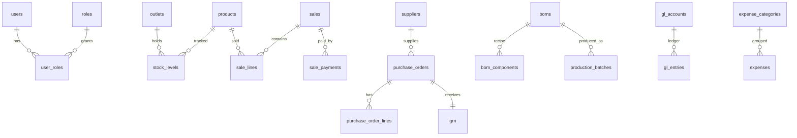

# ModernTech Commerce OS — MySQL package

Production-ready schema, seed data, views, stored procedures and triggers for
the inventory, production, POS, finance and customer management system
described in the SRS.

## Requirements

- MySQL 8.0+ (InnoDB, `utf8mb4_0900_ai_ci`)
- A user with `CREATE`, `INSERT`, `UPDATE`, `DELETE`, `TRIGGER`, `EXECUTE` privileges

## Run order

```bash
DB_HOST=localhost DB_USER=root DB_PASS=secret ./migrate.sh
```

The script executes files in this exact order:

1. `schema/*.sql`      — tables, constraints, indexes
2. `seed/*.sql`        — roles, demo users, catalogue, opening balances
3. `views/*.sql`       — reporting views (sales daily, stock valuation, AR ageing, P&L)
4. `procedures/*.sql`  — `sp_finalize_sale`, `sp_run_production`
5. `triggers/*.sql`    — low-stock notifications, price-change & user-delete audit

## File map

```
db/mysql/
├── migrate.sh
├── schema/
│   └── 001_init.sql
├── seed/
│   └── 001_seed.sql
├── views/
│   └── 001_views.sql
├── procedures/
│   └── 001_procedures.sql
└── triggers/
    └── 001_triggers.sql
```

## Module → table map

| Module           | Tables                                                                          |
|------------------|---------------------------------------------------------------------------------|
| Auth & RBAC      | `users`, `roles`, `user_roles`, `permissions`, `role_permissions`               |
| Outlets          | `outlets`                                                                       |
| Catalogue        | `categories`, `products`, `product_variants`                                    |
| Inventory        | `stock_levels`, `stock_batches`, `stock_movements`, `stock_counts`, `stock_count_lines` |
| Suppliers/Purch. | `suppliers`, `purchase_orders`, `purchase_order_lines`, `grn`, `grn_lines`, `supplier_invoices` |
| Customers/POS    | `customers`, `sales`, `sale_lines`, `sale_payments`, `sale_returns`             |
| Production       | `boms`, `bom_components`, `production_batches`                                  |
| Finance          | `gl_accounts`, `gl_entries`, `expense_categories`, `expenses`                   |
| Alerts & audit   | `notifications`, `audit_log`                                                    |
| Offline sync     | `sync_queue`                                                                    |

## Entity overview



## Offline sync strategy

- POS terminals write to a local SQLite/IndexedDB store and append to a
  `sync_queue` mirror on-device.
- A background worker POSTs queued payloads to your sync endpoint. The
  server inserts into `sync_queue` (status `pending`) keyed by `device_id`
  and `client_ts`.
- A reconciliation job applies pending rows in `client_ts` order:
  - **Sales** — append-only; last-writer-wins on duplicate `id`.
  - **Master data** (products, customers) — field-level merge: server
    keeps the latest `updated_at`; conflicting older edits are flagged
    `conflict` for review.
- Failed applications increment `attempts`; rows >5 attempts move to
  `failed` and surface in an admin view.

## Hardening checklist (before going live)

- Replace seeded `password_hash` values with real bcrypt hashes
- Enforce password complexity at the application layer
- Add per-environment `GRANT`s; never run the app as `root`
- Configure automated daily logical backups (`mysqldump --single-transaction`)
- Enable binary logging for point-in-time recovery
- Set `innodb_flush_log_at_trx_commit=1` and `sync_binlog=1` for durability
